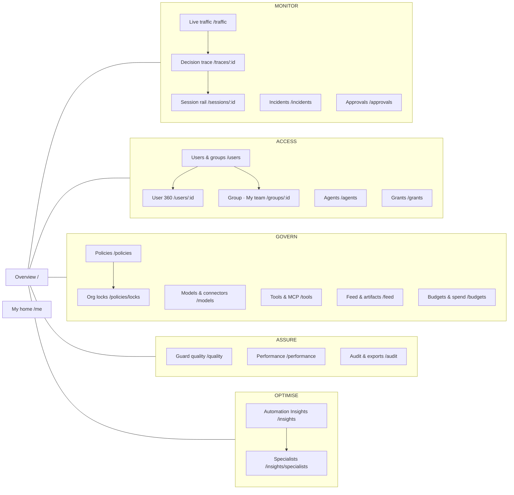
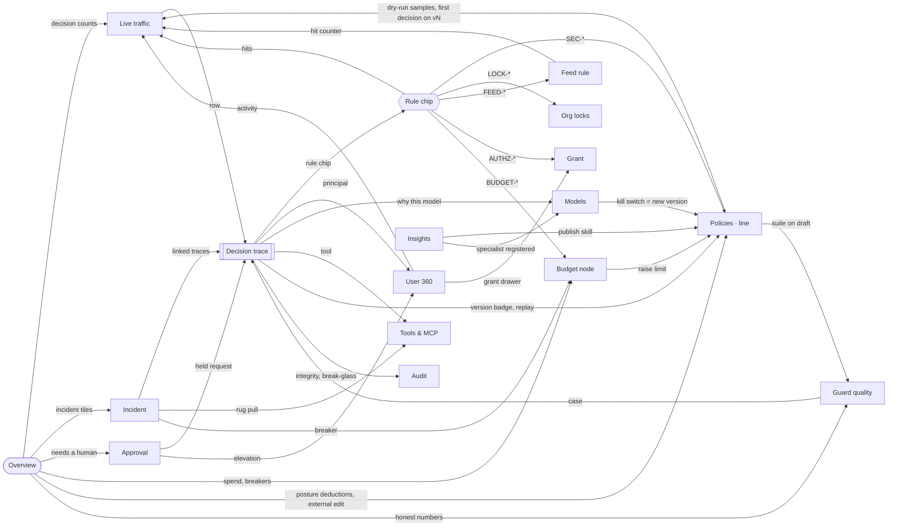

# Concept navigation map

*Companion to [01-information-architecture.md](01-information-architecture.md). Interactive version (role filter, flow paths, link details): open [navigation-map.html](navigation-map.html) in a browser.*

Three maps:
1. **Sitemap** — where each view lives in the navigation.
2. **Evidence links** — how views link to each other (the explainability contract: every number and decision leads to its evidence).
3. **Concept → panel** — where each `CONCEPT.md` section becomes visible in the panel.

---

## 1. Sitemap

## 2. Evidence links (cross-navigation)

The spine is **signal → event → trace → rule → policy line → change**. The rule chip is the hub: it resolves every rule ID to its source.

## 3. Concept → panel

| `CONCEPT.md` § | Topic | Where it is visible in the panel |
|---|---|---|
| §1, §4 | Gateway sees all traffic, both ways | Live traffic (inspection-point column and filter), Overview decision strip |
| §3 (7) | Every decision is explainable | Decision trace; rule chip popover; version badges everywhere |
| §3 (8) | Measure false blocks as hard as blocks | Overview "honest numbers"; Guard quality; impact preview |
| §5, §5.2 | Clients, Keycloak, personal API keys | User 360 header + API keys tab; `/me` keys; trace Identity stage |
| §5.1, §10 | OpenCode plugin, managed config, lockdown | Tools & MCP › OpenCode built-ins; incidents: forbidden model, plugin bypass |
| §6.1 | Inspection points | Live traffic `point` column and filter; trace header |
| §6.2 | Stages | Trace › Pipeline stage rows; Performance stage waterfall |
| §6.3 | Actions | Decision badges (one visual per action) everywhere; trace outcome row |
| §6.4 | Presets | Policies › Presets form; Guard quality per-preset table and strictness matrix |
| §6.5 | Graded risk score | Trace › Risk factors; Approvals "why held" |
| §6.6 | Shadow judge, calibration | Overview estimated miss rate; Guard quality › judge calibration, shadow judge |
| §7 | Routing, `auto` | Trace › "Why this model"; Models › registry routed share |
| §7.1 | Connectors, grants, resolution order | Models › connectors (kill switch), access matrix; User 360 › effective access with sources; Grants |
| §7.3, §15.1 | Specialists picked by `auto` | Trace routing steps; Insights › Specialists; Budgets › savings |
| §8 | Budgets, breakers, guard spend | Budgets & spend; Overview cost column; incidents (budget breach) |
| §9 | Tools, MCP, Rule of Two, agents, approvals | Tools & MCP; Approvals; Agents (delegation chains); trace session rail (taint) |
| §9.2 | Signature feed, artifact scanner | Feed & artifacts; `FEED-*` rule chips; Models › scan status |
| §11.0 | YAML rules vs DB assignments | Source chips (`groups.yaml L22` vs `grant g-0412`); Grants view |
| §11.1 | Editing, hot reload, versions, dry-run | Policies (form, YAML, history, conflict, invalid file); status-bar version badge |
| §11.2 | Org locks | Policies › Org locks; locked ranges in YAML; disabled form fields |
| §12 | Panel views, break-glass | All views; break-glass modal; Audit › break-glass log; Overview count |
| §13 | Audit log, OCSF, hash chain | Audit & exports; chain badge in status bar; trace › integrity |
| §14 | Automation Insights, k-anonymity | Insights; `/me` personal suggestions |
| §16 | Test suite and metrics | Guard quality; suite deltas in policy impact preview |
| §17 | Demo scenarios | Flows F1–F12 in [02-flows.md](02-flows.md); Demo checklist on Overview *(S1)* |
